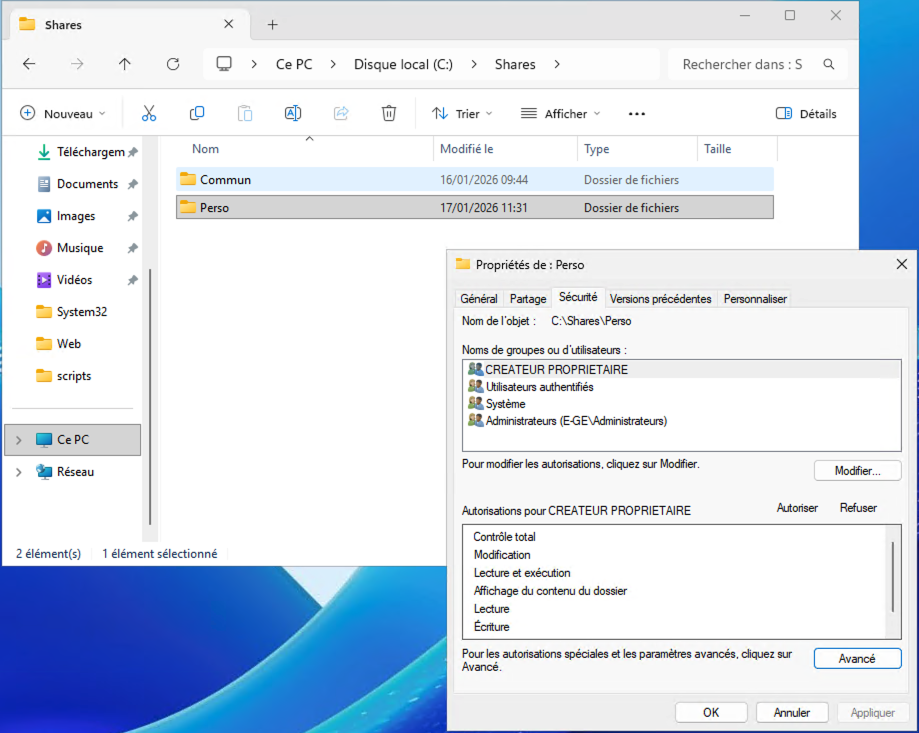
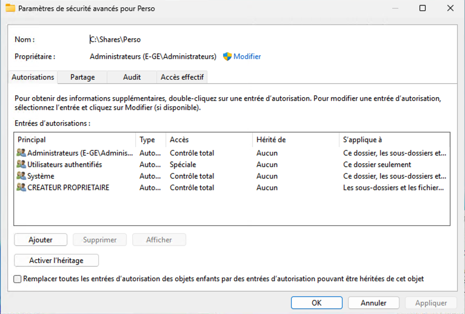
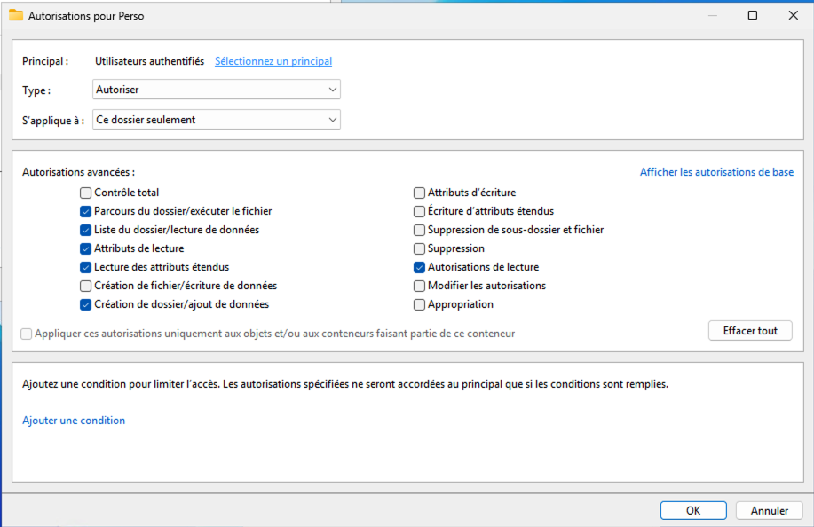
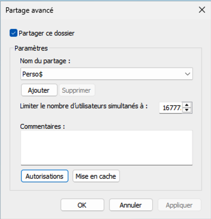
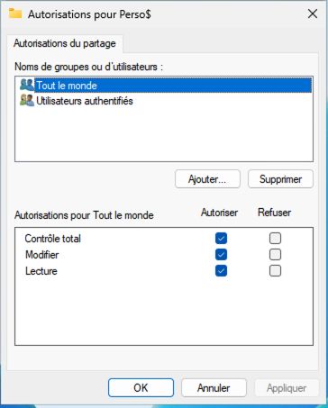
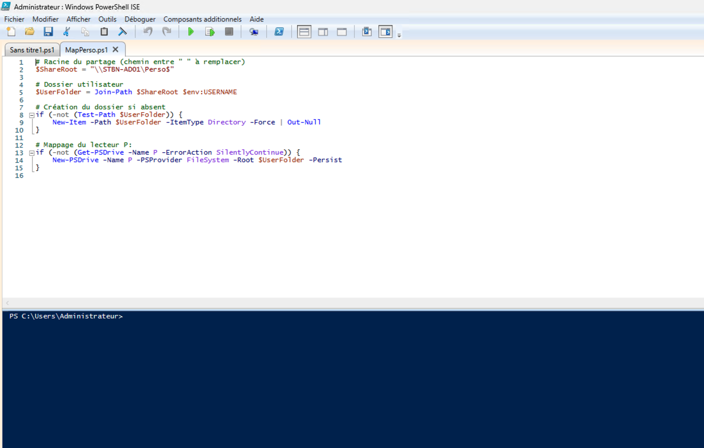
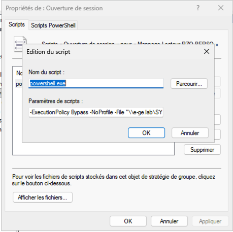
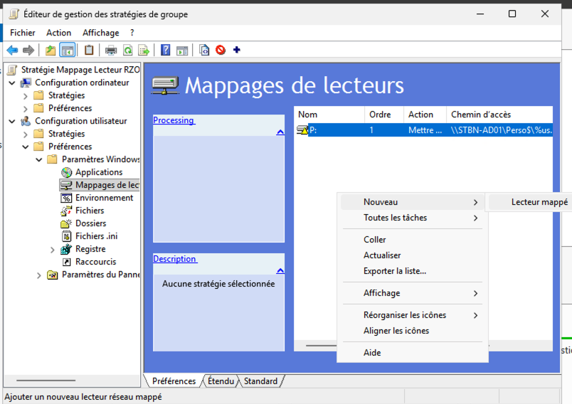
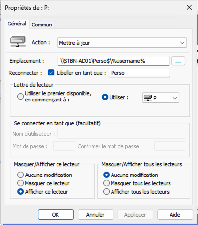

# Mappage de Lecteur réseau Personnel

**OBJECTIF** :

Mettre en place un lecteur réseau personnel `(\Perso$)` mappé automatiquement pour chaque utilisateur, **avec création automatique du dossier utilisateur à la connexion**, dans un domaine Active Directory.

---

## Contexte

- Serveur AD / fichiers (exemple) : `STBN-AD01`
- Domaine : `e-ge.lab`
- Partage : `Perso\$`
- Chemin réel sur le serveur : `C:\Shares\Perso`
- Lettre de lecteur : `P:`

⚠️ **Remplace** `STBN-AD01` **et** `e-ge.lab` **par ton nom de serveur et de domaine.**

---

## Problème rencontré

- Le mappage via GPO (`\\serveur\Perso$\%username%`) fonctionne **uniquement si le dossier existe déjà**.
- La GPO *Lecteurs mappés* **ne crée pas de dossier de manière fiable**.

➡️ Solution : **script PowerShell exécuté à l’ouverture de session utilisateur**. 🎉

---

## 1. Configuration NTFS du dossier Perso

Crée un dossier : `C:\Shares\Perso`

### Autorisations NTFS (paramètres de sécurité avancés)

**Procédure :**
1. Clic droit sur le dossier `Perso` → `Propriétés` → onglet `Sécurité` → `Avancé`
2. Supprime toutes les entrées existantes
3. Ajoute les entrées suivantes :

| Principal                     | Droits                  | S’applique à                          |
| ----------------------------- | ----------------------- | ------------------------------------- |
| Administrateurs               | Contrôle total          | Ce dossier, sous-dossiers et fichiers |
| SYSTEM                        | Contrôle total          | Ce dossier, sous-dossiers et fichiers |
| **Utilisateurs authentifiés** | Autorisations spéciales | **Ce dossier uniquement**             |
| **CREATOR OWNER**             | Contrôle total          | Sous-dossiers et fichiers             |

*Les captures suivantes montrent la configuration attendue :*
<details>
  <summary>📸︲Configuration NTFS du dossier Perso</summary>

---



*Propriétés de : Perso* 




*Paramètres de sécurité avancés pour Perso*


</details>

---


### Détails pour *Utilisateurs authentifiés*

Autoriser les droits suivants :
- [x] Parcours du dossier
- [x] Liste du dossier
- [x] **Créer des dossiers / ajouter des données**
- [x] Lire les attributs
- [x] Lire les autorisations

⚠️ **S'applique à : Ce dossier uniquement** (pas aux sous-dossiers)


*Les captures suivantes montrent la configuration attendue :*
<details>
  <summary>📸︲Autorisations pour Utilisateurs authentifiés</summary>

---



*Détails pour Utilisateurs authentifiés* 


</details>

---

## 2. Partage du dossier

**Nom du partage :** `Perso$` (le `$` rend le partage caché)

**Procédure :**
1. Clic droit sur le dossier → `Propriétés` → onglet `Partage` → `Partage avancé`
2. Donne le nom : `Perso$`
3. Clic sur `Autorisations`
4. Assure que `Authenticated Users` a le droit **Contrôle total**

*Les captures suivantes montrent la configuration attendue :*
<details>
  <summary>📸︲Autorisation de Partage avancé</summary>

---



*Détails pour Partage avancé* 



*Autorisation de Partage avancé*

</details>

---

## 3. Script PowerShell de création + mappage

### Emplacement du script

Le script doit être placé dans le dossier SYSVOL du domaine, accessible à tous les clients :

```text
\\STBN-AD01\SYSVOL\e-ge.lab\scripts\MapPerso.ps1
```

**Procédure :**
1. Connecte-toi au serveur AD
2. Crée le dossier `scripts` s'il n'existe pas : `\\STBN-AD01\SYSVOL\e-ge.lab\scripts\`
3. Crée le fichier `MapPerso.ps1` avec le contenu ci-dessous

⚠️ **Remplace `STBN-AD01` par le nom de ton serveur AD et `e-ge.lab` par ton domaine.**

### Contenu du script

```powershell
# Racine du partage
$ShareRoot = "\\STBN-AD01\Perso$"

# Dossier utilisateur
$UserFolder = Join-Path $ShareRoot $env:USERNAME

# Création du dossier si absent
if (-not (Test-Path $UserFolder)) {
    New-Item -Path $UserFolder -ItemType Directory -Force | Out-Null
}
```

*Les captures suivantes montrent la configuration attendue :*
<details>
  <summary>📸︲Le Script PowerShell</summary>

---



*Script PowerShell* 

</details>

---

## 4. Configuration de la GPO

Cette GPO exécutera automatiquement le script PowerShell à chaque connexion utilisateur.

**Créer une nouvelle GPO :**
1. Ouvre `Gestion des stratégies de groupe` (gpmc.msc)
2. Fais un clic droit à la racine du domaine
3. Sélectionne `Créer un objet GPO dans ce domaine, et le lier ici...`
4. Donne un nom (ex: `Mappage-Lecteur-Perso`)
5. Clic sur `OK`

**Configurer le script PowerShell :**

1. Clic droit sur la GPO nouvellement créée → `Modifier...`
2. Va à : `Configuration utilisateur` → `Stratégies` → `Paramètres Windows` → `Scripts (ouverture/fermeture de session)` → `Ouverture de session`
3. Clic droit dans la zone vide → `Ajouter...` 


**Remplis les champs suivants :**

- **Script** : `powershell.exe`
- **Paramètres du script** :
  ```
  -ExecutionPolicy Bypass -NoProfile -File "\\STBN-AD01\SYSVOL\e-ge.lab\scripts\MapPerso.ps1"
  ```

⚠️ **Remplace `STBN-AD01` par le nom de ton serveur AD et `e-ge.lab` par ton domaine.**

---

**Configurer le mappage du lecteur :**

Maintenant, ajoute le mappage graphique du lecteur P: pour l'interface utilisateur.

1. Toujours dans l'Éditeur de gestion des stratégies de groupe, va à : `Configuration utilisateur` → `Préférences` → `Paramètres Windows` → `Mappages de lecteurs`
2. Clic droit dans la zone vide → `Nouveau` → `Lecteur mappé`

**Paramètres à remplir :**

- **Action :** `Mettre à jour`
- **Emplacement :** `\\STBN-AD01\Perso$\%username%`
- **Libeller en tant que :** `Perso`
- **Lettre de lecteur :** `P`
- **Afficher/Masquer ce lecteur :** `Afficher ce lecteur`
- **Onglet Commun :** Coche `Exécuter dans le contexte de sécurité de l'utilisateur connecté`

⚠️ **Remplace `STBN-AD01` par le nom de ton serveur.**

---

*Les captures suivantes montrent la configuration attendue :*
<details>
  <summary>📸︲Paramétrage Script et Mappage de lecteur</summary>

---



*Paramétrage du script PowerShell* 



*Ajouter lecteur mappé* 



*Propriétés du lecteur mappé* 
</details>

## 5. Test et validation

**Sur le serveur AD :**

```bash
gpupdate /force
````

**Sur le pc client :**

```bash
gpupdate /force
```
**et pour se déconnecter :**

```bash
logoff
```

### Résultat attendu

✔ **Sur le serveur :** Le dossier `C:\Shares\Perso\nom_utilisateur` est créé automatiquement

✔ **Sur le poste client :** Le lecteur `P:` apparaît dans l'Explorateur et pointe vers `\\STBN-AD01\Perso$\nom_utilisateur`

✔ **Isolation des données :** Chaque utilisateur n'a accès qu'à son propre dossier personnel grâce aux autorisations NTFS

---

## Conclusion

**Le script PowerShell** crée automatiquement le dossier utilisateur s'il n'existe pas.

**Le mappage de lecteur via GPO** assure le mappage du lecteur P: et évite les problèmes liés aux scripts seuls.

**L'isolation des données** est garantie par les autorisations NTFS : chaque utilisateur ne voit et n'accède qu'à son propre dossier personnel.